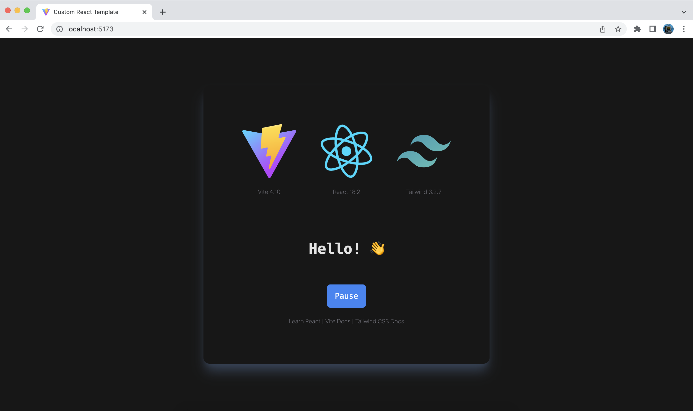

<h3 align="center">
  React, Tailwind CSS & Vite Starter Template 
</h3>
<br/>



This is a starter template for React, Tailwind CSS & Vite.

### Built With

- React v18
- Vite
- Tailwind CSS
- Eslint
- Prettier

### Clone this repo

You can also clone this repo.

```bash
git clone https://github.com/yigitaksoy/react-vite-tailwind-starter.git
```

### Installation

```terminal
npm install
```

Then run dev server by running:

```terminal
npm run dev
```

<br>

- This project runs on `http://localhost:5173/`
